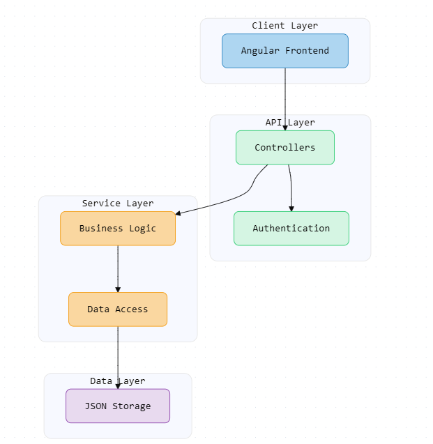

# Cat Rescue Portal

A full-stack application for managing cat adoptions, featuring both frontend and backend components.

## Demo

## Project Structure

- Frontend: Angular-based web interface
- Backend: .NET Core API
- Data: JSON-based storage system

## Core Features

- User authentication and registration
- Cat management with breed information
- Adoption application processing
- Location-based search
- Tenant-specific access control

## Technical Stack

- Frontend: Angular 18, TypeScript
- Backend: .NET Core 8.0, C#
- Storage: JSON files
- Authentication: JWT
- API Documentation: Swagger

## Architecture Overview
The project follows a layered architecture with clear separation of concerns:

## Getting Started

1. Clone the repository
2. Review individual README files in frontend and backend folders
3. Follow setup instructions for each component

### Feedback - TO DOs

1. BE: Maintain consistency in responses to HTTP requests and error handling. If using logger then use it through the project.
2. On the FE, maintain consistency in aspects of html files sign in, sign up vs cat-list, cat-detail, etc.
3. The property "JwtSecretKey" in settings.json file needs to be atleast 120 bits long